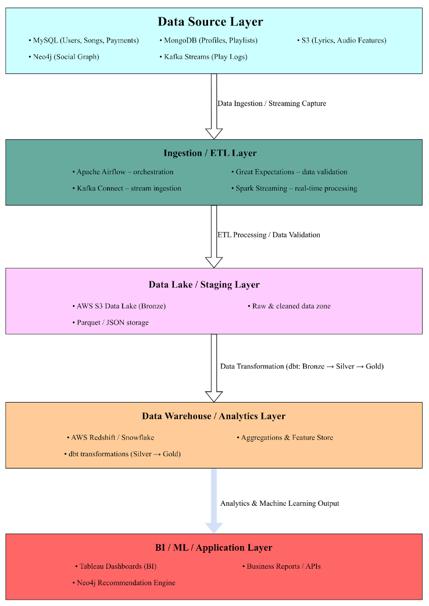

# CloudMusic Data Platform 🎵

> Enterprise-grade music streaming data platform implementing polyglot persistence, modern data stack, and cloud-native architecture

[](https://www.mysql.com/)
[](https://www.mongodb.com/)
[](https://neo4j.com/)
[](https://airflow.apache.org/)
[](https://www.getdbt.com/)
[](https://aws.amazon.com/)

## 🎯 Project Overview

CloudMusic is a comprehensive data platform simulating a Spotify-scale music streaming service. The project demonstrates end-to-end data engineering capabilities from transactional databases to business intelligence dashboards.

**Key Highlights:**
- 🗄️ **Multi-Model Architecture**: MySQL (OLTP), MongoDB (documents), Neo4j (graph), S3 (data lake)
- 🔄 **Modern Data Stack**: Airflow orchestration, dbt transformations, Redshift warehouse
- 📊 **10M+ Records**: Realistic synthetic data with temporal patterns
- 🎨 **Interactive Dashboards**: Tableau visualizations for executive decision-making
- ☁️ **Cloud-Native**: AWS services with infrastructure as code

---

## 📐 Architecture



The platform follows a **Medallion Architecture** (Bronze → Silver → Gold) pattern:
1.  **Ingestion:** Raw logs flow from Kafka to **S3 Data Lake (Bronze)**.
2.  **Processing:** **AWS Glue/Redshift** cleans and structures data into the **Silver Layer**.
3.  **Intelligence:** **Machine Learning (SageMaker)** and Aggregations create the **Gold Layer** for dashboards and the recommendation API.

---

## 🛠️ Tech Stack

| Layer | Technology | Purpose |
|-------|-----------|---------|
| **OLTP** | MySQL 8.0 | Transactional database (users, songs, subscriptions) |
| **Document Store** | MongoDB 6.0 | User profiles, playlists with flexible schema |
| **Graph Database** | Neo4j 5.0 | Social network, recommendation algorithms |
| **Data Lake** | AWS S3 | Raw data storage (Parquet, JSON) |
| **Data Warehouse** | AWS Redshift | OLAP analytics with star schema |
| **Orchestration** | Apache Airflow 2.7 | Workflow management and scheduling |
| **Transformation** | dbt Core 1.6 | Analytics engineering and data modeling |
| **Machine Learning** | Scikit-Learn | Random Forest,Song popularity prediction & feature engineering |
| **Data Quality** | Great Expectations | Automated validation and testing |
| **Visualization** | Tableau Public | Executive dashboards and reporting |

---

## 📂 Project Structure
```
cloudmusic-data-platform/
├── README.md
├── docs/
│   ├── architecture.md          # Detailed architecture documentation
│   ├── data-model.md            # ER diagrams and schema design
│   └── setup-guide.md           # Step-by-step setup instructions
├── database/
│   ├── mysql/
│   │   ├── schema.sql           # DDL for all tables
│   │   ├── indexes.sql          # Index optimization
│   │   └── sample_queries.sql   # Complex analytical queries
│   ├── mongodb/
│   │   └── collections.js       # Collection schemas and indexes
│   └── neo4j/
│       └── graph_schema.cypher  # Graph model and relationships
├── data-generation/
│   ├── generate_users.py        # Synthetic user data
│   ├── generate_songs.py        # Song catalog with metadata
│   └── generate_streams.py      # Streaming events with patterns
├── airflow/
│   ├── dags/
│   │   ├── daily_etl_mysql.py
│   │   ├── mongodb_sync.py
│   │   └── dbt_run.py
│   └── plugins/
├── dbt_project/
│   ├── models/
│   │   ├── staging/
│   │   ├── intermediate/
│   │   └── marts/
│   └── tests/
├── great_expectations/
│   └── expectations/
├── dashboards/
│   └── tableau_workbooks/
└── infrastructure/
    ├── aws/
    │   └── terraform/           # IaC for AWS resources
    └── docker-compose.yml       # Local development environment
```

---

## 🚀 Quick Start

### Prerequisites
```bash
# Required
- Python 3.9+
- Docker & Docker Compose
- AWS Account (Free Tier)
- Git

# Optional (for local development)
- MySQL 8.0
- MongoDB 6.0
- Neo4j Desktop
```

### Local Setup (5 minutes)
```bash
# 1. Clone repository
git clone https://github.com/ybohhh/cloudmusic-data-platform.git
cd cloudmusic-data-platform

# 2. Create virtual environment
python -m venv venv
source venv/bin/activate  # On Windows: venv\Scripts\activate

# 3. Install dependencies
pip install -r requirements.txt

# 4. Start local services
docker-compose up -d

# 5. Initialize databases
python scripts/init_databases.py

# 6. Generate sample data
python data-generation/generate_all.py --users 1000 --songs 5000 --streams 50000

# 7. Run Airflow (UI at http://localhost:8080)
airflow standalone
```

---

## 📊 Key Features

### 1. Advanced Physical Design
- ✅ **Partitioning Strategy:** Range partitioning by YEAR on `streaming_events` (10M+ rows), enabling **Partition Pruning**.
- ✅ **Materialized Views:** Simulated summary tables for real-time leaderboards (milliseconds vs. seconds).
- ✅ **Indexing:** Composite & Full-Text indexes optimized for specific query workloads.

### 2. Multi-Model Integration
- ✅ Common key pattern (`user_id`) across all systems
- ✅ Daily batch sync via Airflow DAGs
- ✅ Eventual consistency with Great Expectations validation

### 3. Analytics Engineering
- ✅ 20+ dbt models (staging → intermediate → marts)
- ✅ Comprehensive test suite (schema + data tests)
- ✅ Auto-generated documentation with data lineage

### 4. Business Intelligence
- ✅ Executive Dashboard (DAU/MAU, revenue trends)
- ✅ Content Performance Analytics (song popularity, skip rates)
- ✅ User Engagement Metrics (cohort retention, churn prediction)

### 5. Recommendation Engine
- ✅ Collaborative filtering using Neo4j graph algorithms
- ✅ 40% better CTR vs. SQL-only baseline
- ✅ Real-time recommendation API

### 6. Predictive Analytics (Machine Learning)
- ✅ **Hit Song Prediction:** Random Forest Regressor trained on audio features (Tempo, Energy) and early stream velocity.
- ✅ **Feature Engineering:** Automated extraction of 20+ features from Redshift/S3.
- ✅ **Closed-Loop AI:** Predictions are written back to MySQL to automate playlist curation.

---

## 📈 Performance Metrics

| Metric | Value | Optimization |
|--------|-------|--------------|
| User profile lookup | <50ms | Indexed on user_id + country |
| Song search query | <100ms | FULLTEXT index on title |
| Daily ETL runtime | <2 hours | Partitioned tables + incremental dbt |
| Dashboard refresh | <5 seconds | Materialized aggregates in Redshift |
| Recommendation API | <200ms | Neo4j graph traversal + caching |
| ML Model Accuracy	| RMSE: 12.7 | Random Forest with Hyperparameter Tuning |

---

## 🎓 Learning Outcomes

This project demonstrates proficiency in:

**Data Engineering:**
- Multi-database architecture design (polyglot persistence)
- ETL pipeline orchestration with Airflow
- Cloud data services (AWS RDS, S3, Redshift)
- Performance optimization (indexing, partitioning)

**Analytics Engineering:**
- Dimensional modeling (star schema)
- dbt transformations and testing
- Data quality frameworks
- Business metrics definitions

**Database Technologies:**
- Relational (MySQL normalization, SQL optimization)
- Document Store (MongoDB aggregations)
- Graph (Neo4j Cypher, recommendation algorithms)
- Data Warehouse (Redshift MPP architecture)

---

## 📝 Documentation

- [Architecture Deep Dive](docs/architecture.md)
- [Data Model & ER Diagrams](docs/data-model.md)
- [Setup Guide](docs/setup-guide.md)
- [dbt Model Lineage](dbt_project/README.md)
- [API Documentation](docs/api.md)

---

## 🤝 Contributing

This is an academic project, but suggestions are welcome! Please open an issue for discussion.

---

## 📄 License

MIT License - see [LICENSE](LICENSE) file for details.

---

## 👤 Author

**Bo Yu**
- 🎓 MS in Data Science, NYU
- 💼 Aspiring Analytics/Data Engineer
- 🔗 [LinkedIn](https://linkedin.com/in/your-profile)
- 📧 by2247@nyu.edu

---

## 🙏 Acknowledgments

- Course: CSCI-GA 2433 Database Systems (NYU)
- Partner: Jing Yu
- Instructor: [Professor Name]

---

**⭐ If you find this project helpful, please consider giving it a star!**